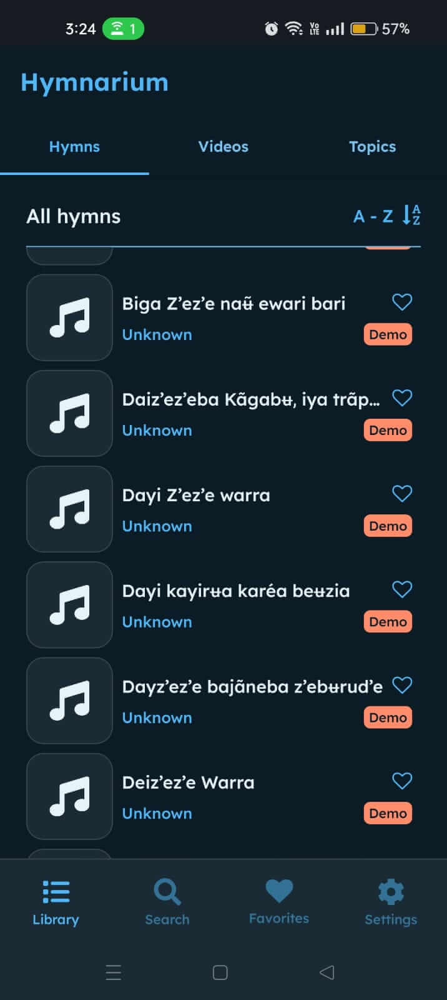
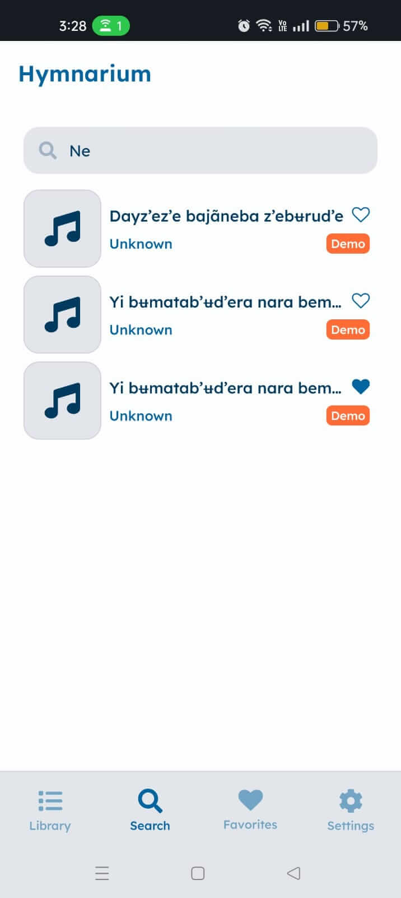
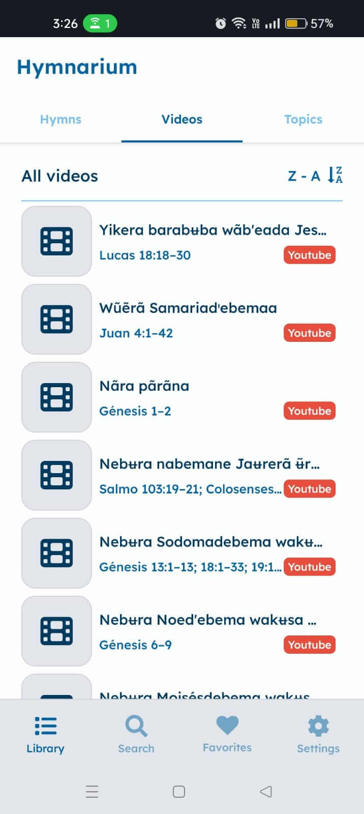

# 🎵 Hymnarium

> A flexible, multilingual template for digital hymnbooks, built with **React Native** and **Expo**. Originally created as part of a real-world project, it’s now a reusable base designed to support different languages, features, and customizations.

## 📸 Screenshots

<div align="center">
  
  
  
  
</div>

## ⚡ Features

- 💾 **Offline Support** - Local SQLite database for offline access
- 🎵 **Audio Playback** - Hymn audio with demo tracks
- 🔀 **Playlist Management** - Sequential and shuffle playback modes
- ⭐ **Favorites System** - Save your favorite hymns
- 🌐 **Multi-language Support** - Adapt content to multiple languages
- 🔍 **Advanced Search** - Search by title or author
- 📂 **Topic Organization** - Browse hymns by theological themes
- 🎞 **Video Integration** - Watch related hymn videos from the Internet
- 🎨 **Dark/Light Themes** - Adaptive UI

## 🛠️ Technologies

- **Framework**: React Native 0.79 with Expo SDK 53
- **Navigation**: Expo Router
- **Styling**: NativeWind
- **Database**: SQLite with Expo SQLite
- **Audio**: Expo Audio
- **State Management**: Zustand
- **Storage**: AsyncStorage for user preferences persistence
- **UI Components**: Custom components with Expo Vector Icons
- **Typography**: Custom Lexend font family
- **Development**: TypeScript, ESLint, Prettier, Metro bundler

## 🚀 Installation and Setup

1. **Prerequisites:**
   - Node.js 18+
   - Expo CLI (`npm install -g @expo/cli`)
   - **For Android**: Android Studio with Android SDK
   - **For iOS**: Xcode (macOS only) with iOS Simulator

2. **Clone the repository:**

   ```bash
   git clone https://github.com/damsonite/hymnarium.git
   cd hymnarium
   ```

3. **Install dependencies:**

   ```bash
   # Using pnpm (recommended)
   pnpm install

   # Or using npm
   npm install

   # Or using yarn
   yarn install
   ```

4. **Configure the database and audio files:**

   ```bash
   # Copy the example database file
   cp assets/dbExample assets/db.db

   # Copy the example audio configuration
   cp config/audioFilesExample.ts config/audioFiles.ts
   ```

   **Note**: Add your audio files to `assets/audio/demos/` and update the references in `config/audioFiles.ts`

5. **Start the development server:**

   ```bash
   # Start Expo development server
   pnpm start

   # Run on specific platforms
   pnpm android  # Android emulator/device
   pnpm ios      # iOS simulator/device
   ```

## 📂 Project Structure

```text
app/
├── _layout.tsx       # Root layout component
├── (tabs)/           # Tab-based navigation
│   ├── _layout.tsx   # Tab layout
│   ├── (library)/    # Hymn library with topics
│   ├── favorites.tsx # User's favorite hymns
│   ├── search.tsx    # Search functionality
│   └── settings.tsx  # App preferences
├── hymns/[id].tsx    # Individual hymn viewer
└── videos/[id].tsx   # Video player

components/
├── hymns/            # Hymn-specific components
├── search/           # Search components
├── settings/         # Settings components
├── shared/           # Reusable UI components
├── topics/           # Topic-related components
└── videos/           # Video components

config/               # App configuration
├── appConfig.ts      # Main app configuration
├── audioFiles.ts     # Audio file mappings (created from audioFilesExample.ts)
└── audioFilesExample.ts # Template for audio file configuration

db/                   # Database operations
├── hymns.ts          # Hymn queries
├── topics.ts         # Topic queries
└── videos.ts         # Video queries

hooks/                # Custom React hooks
├── useAudio.ts       # Audio playback hook
├── useHymn.ts        # Hymn data hook
└── useVideo.ts       # Video data hook

store/                # Zustand stores
├── favorites.ts      # Favorites management
├── language.ts       # Language preferences
├── playlist.ts       # Audio playlist logic
└── theme.ts          # Theme preferences

utils/                # Utility functions
├── color.ts          # Color utilities
├── time.ts           # Time formatting
└── url.ts            # URL utilities

assets/               # Static assets
├── audio/
│   └── demos/        # Audio files (add your MP3 files here)
├── fonts/            # Custom fonts
├── db.db            # SQLite database (created from dbExample)
└── dbExample        # Template database file
```

## 🔥 Template Setup

This project is designed as a reusable template. To customize it for your own hymn collection:

### Database Configuration

1. **Copy the example database:**

   ```bash
   cp assets/dbExample assets/db.db
   ```

2. **Customize the database structure** in `assets/db.db` with your own:
   - Hymns and their translations
   - Authors information
   - Topics/categories
   - Video references

### Audio Files Configuration

1. **Add your audio files** to `assets/audio/demos/` (MP3 format recommended)

2. **Copy and configure the audio mappings:**

   ```bash
   cp config/audioFilesExample.ts config/audioFiles.ts
   ```

3. **Update `config/audioFiles.ts`** to map your hymn IDs to audio file paths:

   ```ts
   export const demos = {
     '1': require('../assets/audio/demos/hymn1.mp3'),
     '2': require('../assets/audio/demos/hymn2.mp3'),
     // Add your audio files here
   };
   ```

### General Configuration

Modify `config/appConfig.ts` to:

- Change app name and metadata
- Add/remove supported languages
- Update default language settings
- Configure social media links

## 🎯 Roadmap

- ✅ Core hymn library with native audio playback
- ✅ Favorites and playlist management
- ✅ Multi-language support
- ✅ Search and topic filtering
- ✅ Offline-first architecture
- 🔄 Enhanced video integration
- 📅 Custom playlists creation
- 🎤 Lyrics highlighting during playback
- 🌍 Additional language support
- 📊 Usage analytics and insights
- ☁️ Optional cloud sync for favorites
- 🎨 More theme options and customization

## 🐛 Bug Reports & Feature Requests

Found a bug or have a feature idea? We'd love to hear from you!

- 🐛 [Report a Bug](https://github.com/damsonite/hymnarium/issues/new?labels=bug)
- 💡 [Request a Feature](https://github.com/damsonite/hymnarium/issues/new?labels=enhancement)

## 💖 Contributing

Thank you for your interest in contributing! Here's how you can help:

1. **Fork the repository**
2. **Create a feature branch** (`git checkout -b feature/amazing-feature`)
3. **Make your changes** and test thoroughly
4. **Commit your changes** (`git commit -m 'Add amazing feature'`)
5. **Push to your branch** (`git push origin feature/amazing-feature`)
6. **Open a Pull Request** with a clear description

### Development Guidelines

- Follow the existing code style (ESLint + Prettier configured)
- Write meaningful commit messages
- Test your changes on multiple platforms when possible
- Update documentation as needed

## 📜 License

This project is distributed under the MIT License. See [LICENSE](LICENSE) for more information.
